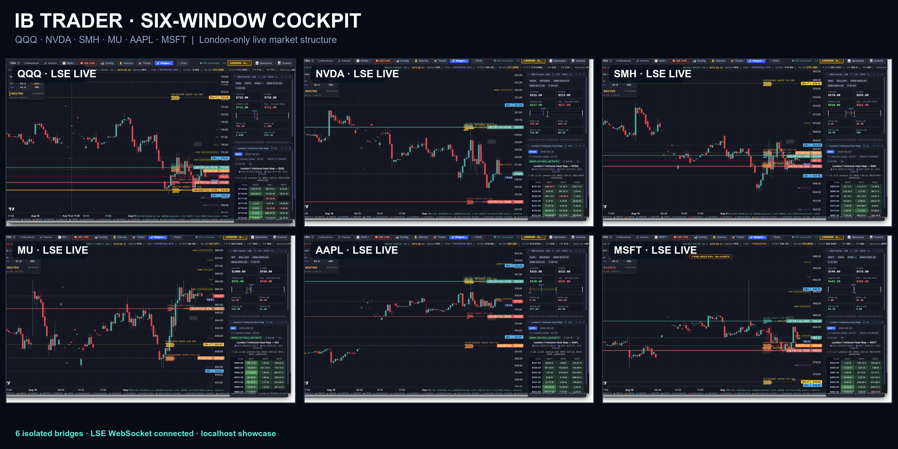

# ib-trader

<p align="center">
  
</p>

<p align="center"><strong>Six isolated London-only cockpit windows on one screen: QQQ, NVDA, SMH, MU, AAPL, and MSFT.</strong></p>

Real-time trading system: **16 C++ signal engines** on 1-minute bars (validated
WR≥70 + out-of-sample walk-forward per ticker), a **~0.3ms local signal pipeline**
(shared Alpaca websocket daemon + IBKR SIP daemon + kqueue dual-source readers), and a
**leveraged-ETF execution layer** on IBKR with broker-resident protection (OCA pairs:
recovery GTC + catastrophic stop). Double-purpose by design: signals drive a human
trading options; the executor autonomously trades leveraged ETFs on the same signals.

**Not financial advice. Live-money code — read the docs before touching anything.**


## 🚀 UN SOLO COMANDO (levantar todo)

```bash
cd ~/Documents/GitHub/ib-trader && zsh scripts/fleet_up.sh
```

| Variante | Qué hace |
|---|---|
| `zsh scripts/fleet_up.sh` | Levanta la flota completa (24 bots + puentes + alarmas + voz). Idempotente: si algo ya corre, no lo duplica. |
| `zsh scripts/fleet_up.sh --chart` | Igual + cockpit del gráfico y lo abre en el navegador. |
| `zsh scripts/fleet_up.sh --status` | Sólo informa qué está vivo. No toca nada. |

Antes de arrancar comprueba que TWS/Gateway está escuchando y que **se puede escribir en
`data/trading-signals/`** — si no, aborta con un error en rojo (el 2026-07-24 se perdieron
señales en silencio justo por eso).

### Pasar a LIVE — lo único que hace un humano

1. **IB Gateway/TWS**: entrar con la cuenta LIVE (TWS 7496 / Gateway 4001).
2. `zsh scripts/ib_mode.sh live`
3. `zsh scripts/fleet_up.sh`

La flota es **SEÑAL-SOLAMENTE**: aunque esté en live, no manda órdenes. Ejecutar exige la
**doble llave**, a propósito:

```bash
order_engine/arm.sh                              # llave 1: ARM_LIVE con la fecha de hoy
order_engine/run.sh --arm-live --sym QQQ         # llave 2: la bandera
order_engine/disarm.sh                           # desarmar
```

Si borras `ARM_LIVE` mientras corre, el motor se desarma en el acto: la doble llave se
re-evalúa antes de **cada** envío.

**Limpiar órdenes del motor**: IBKR sólo deja cancelar desde el **mismo clientId** que las
colocó (el motor usa el 92). Un script con otro clientId falla con error 10147 justo cuando
más falta hace.


## Documentation

| Doc | What's in it |
|---|---|
| [docs/ARCHITECTURE.md](docs/ARCHITECTURE.md) | Full system design: data plane, signal engines, execution plane, file contracts, measured latencies |
| [docs/OPERATIONS.md](docs/OPERATIONS.md) | Runbook: start/stop, kill switch, health checks, activation day, troubleshooting table |
| [docs/TRADING-RULES.md](docs/TRADING-RULES.md) | The trading law: owner orders, ETF map, bull/bear/bag rules, evidence trail, change control |
| [docs/X-WHALE-BOT.md](docs/X-WHALE-BOT.md) | Daily X semis/whale poster: $5/mo budget, Finviz fleet scan, OAuth1, 09:00 Toronto |
| [AGENTS.md](AGENTS.md) | Agent-facing operational law: standing orders, master trading playbook, per-component history |

## The system in five lines

```
Alpaca ws / IBKR TWS ─► C++ daemons ─► bars files ─► kqueue readers (~0.3ms)
  ─► 16 C++ signal bots (1.1µs/bar: capitulation/trend/terremoto engines)
      ├─► Mac banners + voice ─► HUMAN trades options (BUY NOW=call, BUY PUT=put)
      └─► operations logs ─► fleet_executor (ib_insync) ─► leveraged ETFs on IBKR TFSA
            bulls: sell-higher-only + bag w/ GTC+stop OCA · bears: quake-only, stopped, never overnight
```

## Quick start (existing installation)

```bash
zsh scripts/fleet_keepalive_start.sh   # everything signal-side + executor
zsh screener/ensure_all.sh            # ws daemon + scanner stack
rm data/etf_armed                      # KILL SWITCH (trading off; signals unaffected)
```

Key safety facts: the executor only trades when `data/etf_armed` exists AND account
NetLiq ≥ USD 500; circuit breakers (daily-loss halt −5%, sector concurrency cap,
gross leverage ≤1.5×, settled-cash budget) gate every buy; every position carries
broker-resident protective orders that work with this machine powered off; the
account (not local state) is the source of truth; full audit trail in
`data/etf_ledger.csv` **and** `trades.db` (`etf_operations`, `etf_signals`).

Legacy Python was deleted 2026-07-11 (recoverable from git history).
`day_trading_bot.py` remains only as a helper library imported by the screener stack.
